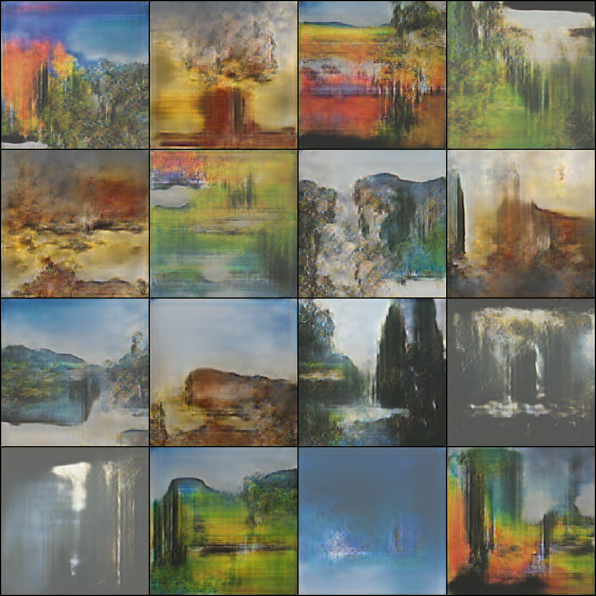

### Generating Landscape Images from High resolution photos/paintings using ProGANs
Original Paper by NVIDIA: https://arxiv.org/abs/1710.10196

# Results

# Usage
Run gen_sample.py with arguments to generate samples

Training GAN from scratch -> Edit pro_gan.py and DataHelper.py as needed

# TO-DO
    1. Write a README                      ------------- DONE
    2. Write Script to interpolate between latent spaces
    3. Train Higher Resolution Generator
    4. Write a Script to generate an Image ------------- DONE
    5. Add Web-scraping scripts used to repo

## Authors

* **Surya Kant Sahu** - [ojus1](https://github.com/ojus1)

## License

This project is licensed under the MIT License - [LICENSE.md](./LICENSE.md)

## Acknowledgments

* Packages used for Machine learning model(s): Python: PyTorch
* ProGAN implementation: [pro_gan_pytorch](https://github.com/akanimax/pro_gan_pytorch)